1. **前期准备**
    - **芯片介绍**：介绍STM32F103C8t6的基本参数，如32位Cortex-M3内核、72MHz主频、64KB片内Flash、20KB片内SRAM ，以及其2.0 - 3.6V的工作电压和应用场景，让读者对芯片有基础认知。
    - **软件安装**：提供STM32CubeMX软件的官方下载地址https://www.st.com/en/development-tools/stm32cubemx.html ，并阐述安装步骤，包括下载安装包后，运行安装程序，在安装导航流程中依次点击“next”，选择安装路径（建议安装在非系统盘），选择是否创建桌面快捷方式等，安装完成后，还需安装对应芯片的固件库，在软件菜单栏点击“help”->“manage embedded software packages”进行安装。

2. **启动并新建项目**
    - **启动软件**：双击桌面快捷方式或从开始菜单启动STM32CubeMX软件。
    - **新建项目**：在软件界面选择“file”菜单，点击“new project”创建新项目。
    - 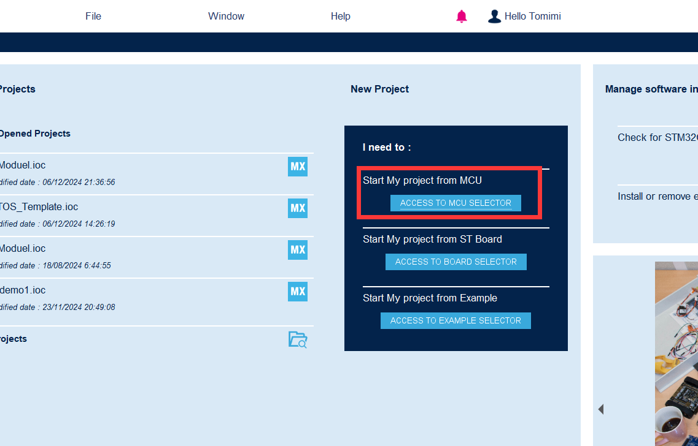

3. **选择MCU**
    - 在新项目向导的“access to mcus”选项卡中，输入“STM32F103C8T6”搜索芯片，然后选择对应的LQFP48封装。
    - 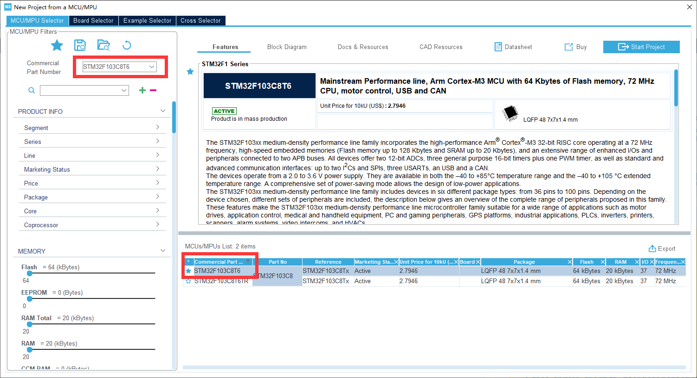

4. **片内外设配置**
    - **系统配置**：在“pinout & configuration”选项卡中，对系统内核RCC和SYS进行配置。RCC配置时，若使用外部晶振，一般选择HSE；SYS配置里，务必选择一个下载器，防止下载程序出现问题。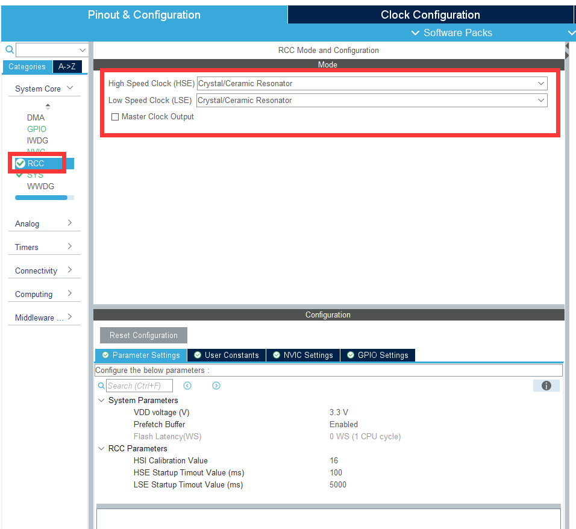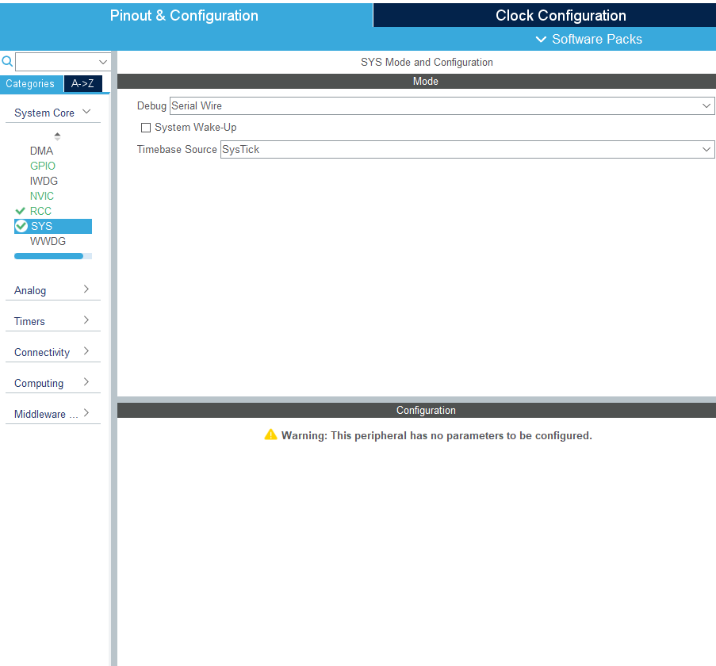

    - **引脚配置**：以GPIO口为例，演示如何将引脚配置为不同功能，如输入、输出、复用功能等，通过拖放的方式将外设连接到相应引脚，并设置对应参数。

      ***设置串口***

      调试串口USART1，不使用中断。

      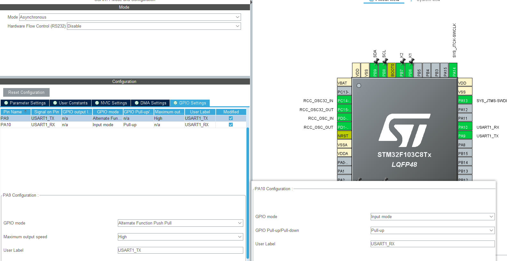

      与ESP8266通信串口

      

      ***设置软件I2C***

      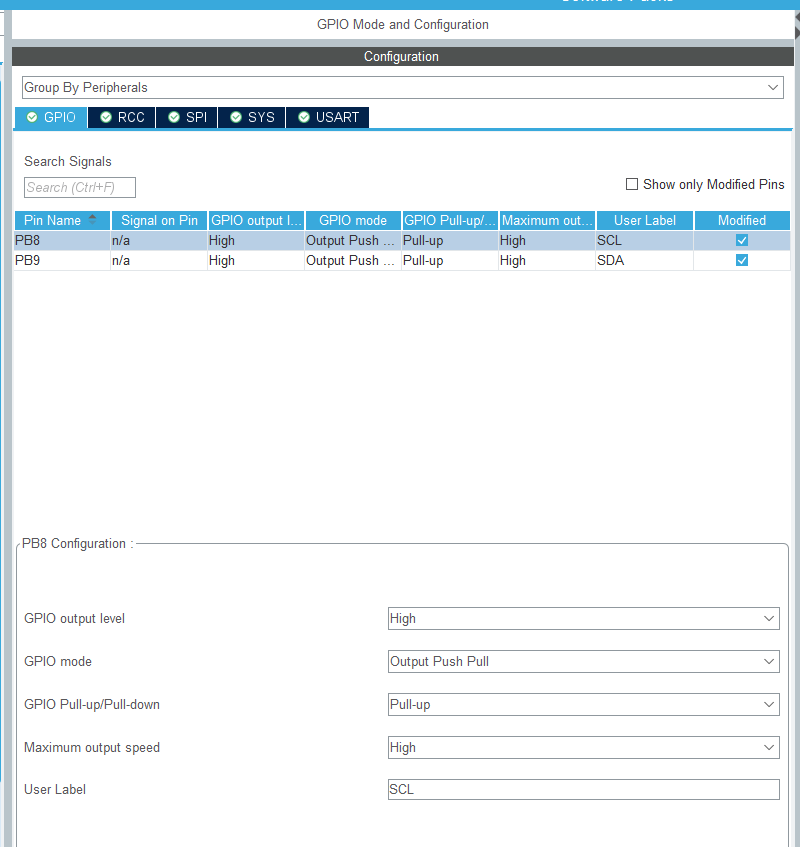

      ***设置硬件SPI控制OLED***

      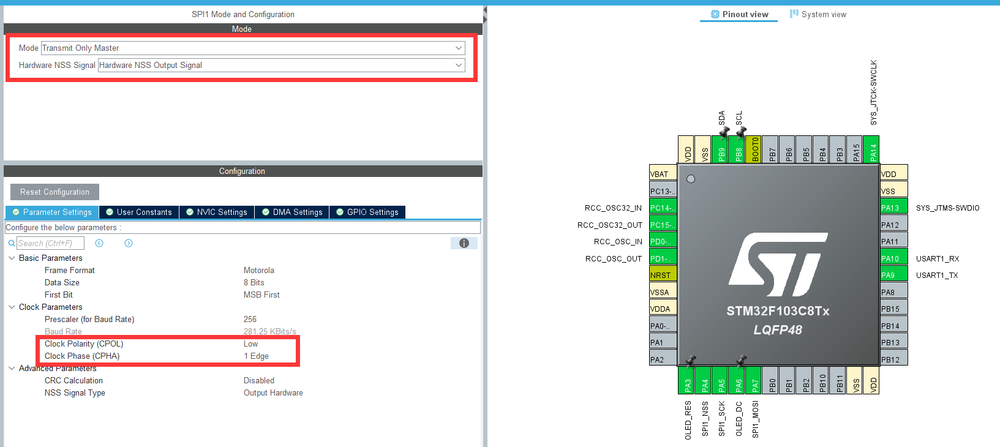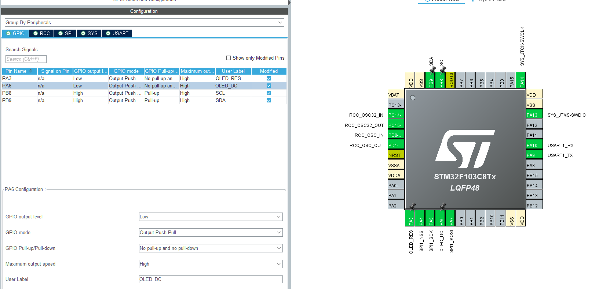

      ***设置按键K1、K2***

      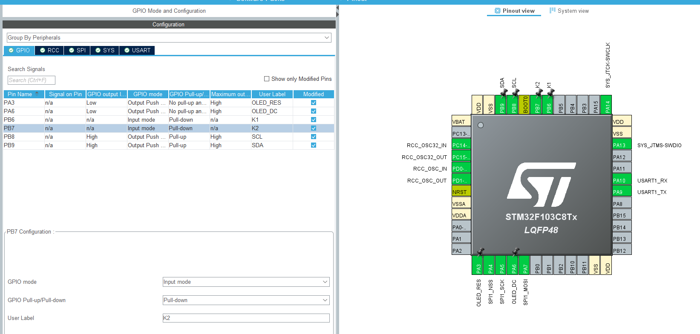

      

5. **时钟配置**
    - **时钟源介绍**：讲解STM32的四个时钟源，即高速外部时钟HSE、低速外部时钟LSE、高速内部时钟HSI、低速内部时钟LSI。
    - **配置流程**：在“clock configuration”选项卡中，若以HSE为系统主时钟，按照特定的分频和倍频设置，使系统达到72MHz主频；若使用HSI为时钟源，也需设置相应的分频系数。若项目用到RTC、IWDG等外设，还需对低速时钟进行配置。
    - 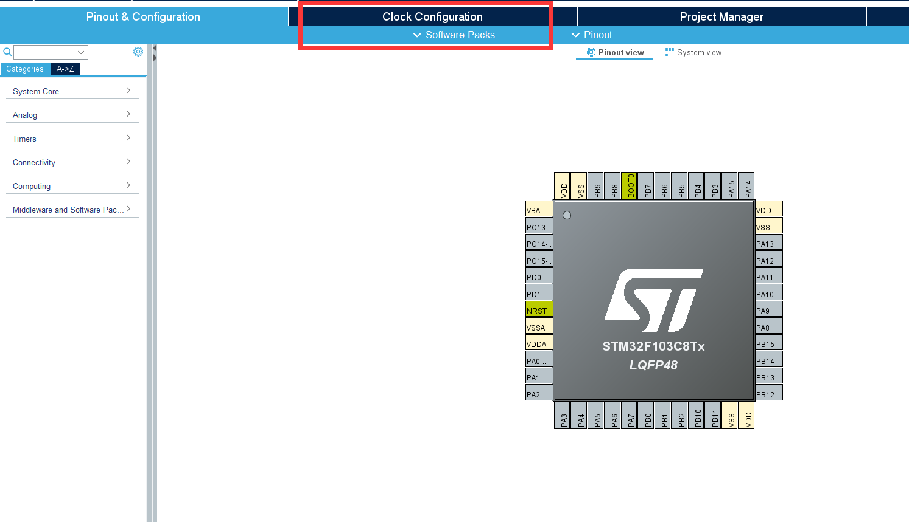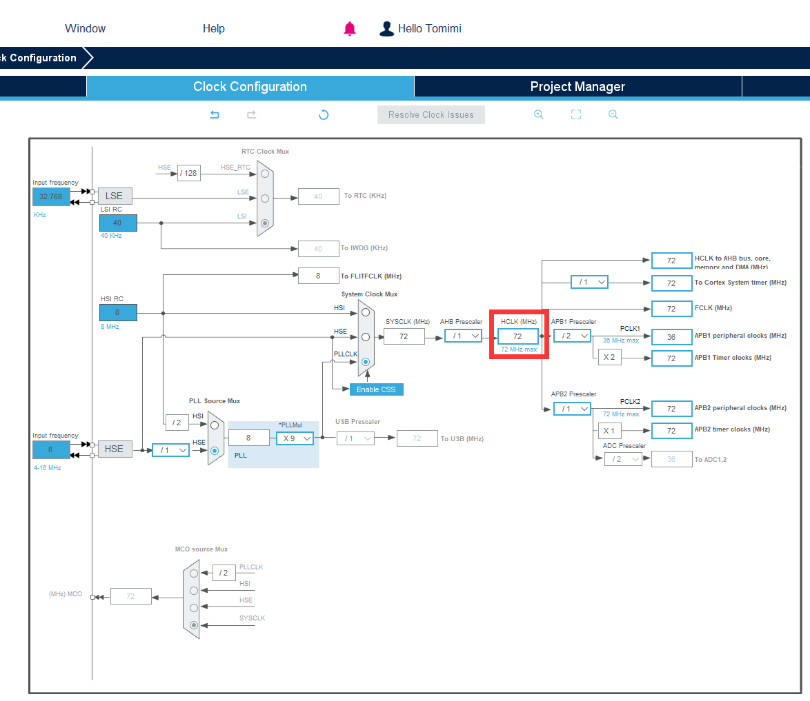

6. **工程管理器设置**
    - **Project设置**：设置Project Name（项目名称）、Project Location（项目保存位置）、Application Struture（应用结构）、Toolchain Folder Location（工具链文件夹位置）、Toolchain/IDE（选择使用的开发工具，如Keil、STM32CubeIDE等 ）。
    - **Code Generator设置**：设置固件包拷贝方式、生成文件的格式和内容、HAL库相关设置、模板设置等。
    - **Advanced Settings设置**：简要介绍驱动选择和调用函数设置。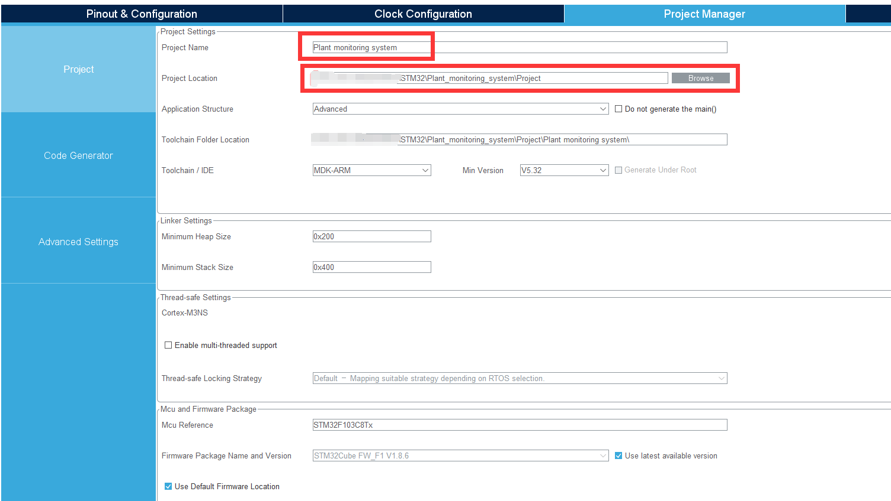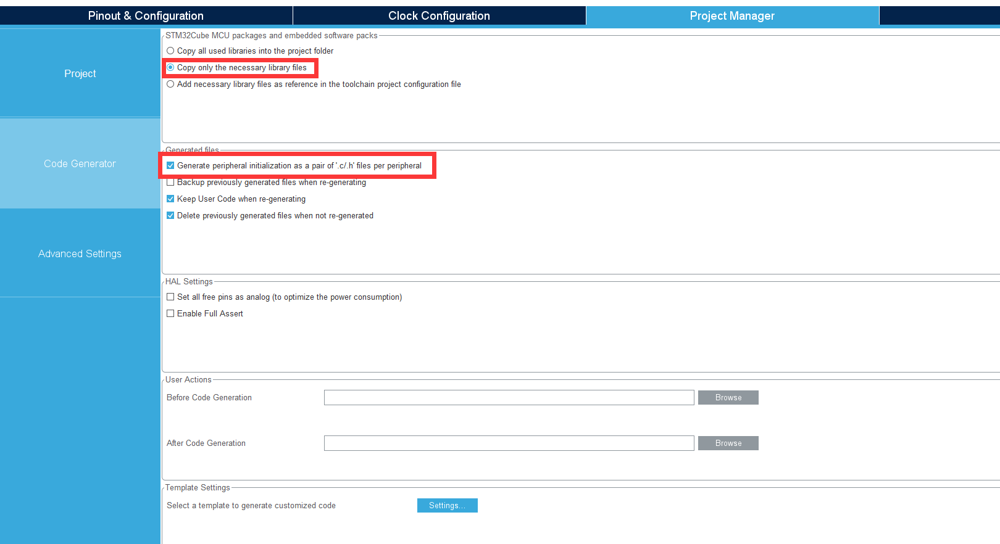

7. **生成代码**
  点击“project”菜单中的“generate code”选项生成代码，生成后会得到一个包含初始化代码和配置文件的项目文件夹，简要介绍下文件结构和各文件的作用。

  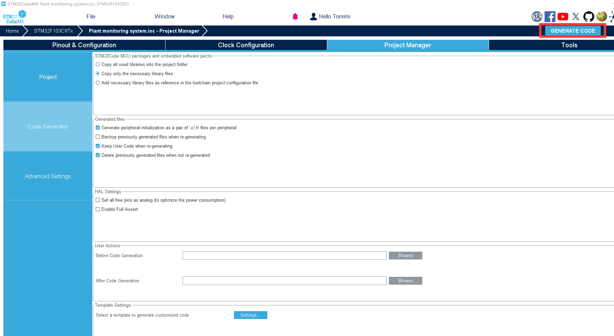

8. **导入代码到IDE（以Keil为例）**
    - **Keil安装**：提供Keil软件下载地址https://www.keil.com/download/product/ ，安装过程同常规软件安装，下一步操作即可。安装完成后，还需导入STM32开发包https://www.keil.com/dd2/pack/ 。
    - **导入操作**：关闭Keil，打开刚才用STM32CubeMX生成的项目，修改编译器相关设置后重新编译。

9. **编译和调试**
    - **编译项目**：在Keil中点击编译按钮，若出现报错，排查常见问题，如语法错误、库文件缺失等。
    - **调试步骤**：连接调试器（如ST - link），设置调试相关参数，如下载算法、调试模式等，进行程序调试。

10. **扩展功能说明**
    说明后续如何根据项目需求在生成的代码框架中添加用户代码，例如中断服务例程、任务调度代码等，提醒用户将自己的代码写在特定的代码块（如USER BEGIN和USER END之间），防止更新项目时代码被覆盖 。 