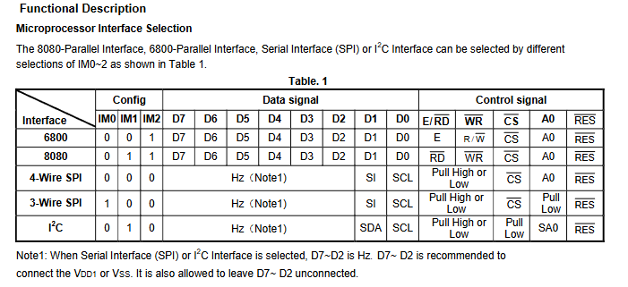
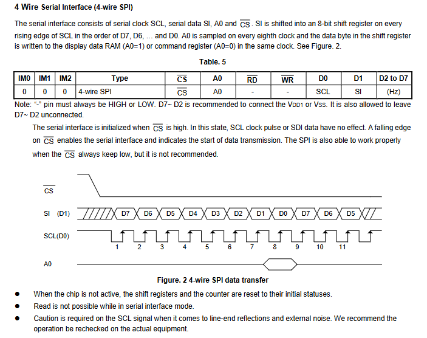

# 编写SPI OLED驱动
## 一、SPI简介

SPI是串行外设接口（Serial Peripheral Interface）的缩写，是由 Motorola 公司提出的一种高速的，全双工，同步的通信总线，被广泛地使用在 ADC、LCD 等设备与 MCU 间要求通讯速率较高的场合。SPI总线系统可直接与各个厂家生产的多种标准外围器件连接，该接口一般使用4条线：串行时钟线（SCK）、主机输入/从机输出数据线MISO、主机输出/从机输入数据线MOST和低电平有效的从机选择线C/S(有的SPI接口芯片带有中断信号线INT或INT、有的SPI接口芯片没有主机输出/从机输入数据线MOSI)。


### 1.1 SPI时序


### 1.2 SPI工作模式


### 1.3 SPI 优缺点


## 二、OLED简介
### 2.1 OLED原理
- 
- 

### 2.2 点阵编码原理与显示
- 
- 

- 


## 三、SH1106显示芯片
### 3.1 关键参数
- 显示规格：支持132×64点阵面板，适用于共阴极型OLED面板。
- 工作电压：逻辑电压\(VDD1\)为1.65 - 3.5V，DC - DC电压\(VDD2\)为3.0 - 4.2V ，OLED工作电压外部\(VPP\)为6.4 - 14.0V，内部\(VPP\)为6.4 - 9.0V。
- 接口类型：具备8位6800/8080系列并行接口、3/4线串行外设接口、400KHz快速\(I^{2}C\)总线接口。

### 3.2 主要特性
- 集成132×64位SRAM ；有多种功能，如可编程帧频、复用比，行列重映射，垂直滚动，片内振荡器，256级对比度控制；支持内部/外部\(VPP\)供电，低功耗（睡眠模式<5mA ）；工作温度范围 - 40℃至 + 85℃ ；有COG封装形式，厚度300mm。

### 3.3 接口选择



### 3.4 SPI驱动时序




- 组成：4线SPI接口由串行时钟（SCL）、串行数据（SI）、A0引脚和片选信号（CS）组成。
- 传输原理：在SCL的每个上升沿，SI上的数据按照D7、D6、……、D0的顺序被移入一个8位的移位寄存器中。同时，A0引脚在每个时钟周期被采样。在同一个时钟周期内，如果A0 = 1，移位寄存器中的数据字节会被写入显示数据RAM；如果A0 = 0，则会被写入命令寄存器，具体可参考Figure 2（图2）。

#### 接口初始化及工作状态
 - 初始化：当\(\overline{CS}\)为高电平时，串行接口处于初始化状态，此时SCL的脉冲和SI上的数据都不会产生作用。
 - 数据传输开始：\(\overline{CS}\)的下降沿将启用串行接口，并标志着数据传输的开始。虽然SPI在\(\overline{CS}\)始终为低电平的情况下也能正常工作，但不建议这样使用。

#### 其他注意事项
 - 芯片非激活状态：当芯片未激活时，移位寄存器和计数器会被重置为初始状态。
 - 读操作限制：在串行接口模式下，无法进行读操作。
 - 时钟信号注意事项：由于SCL信号可能会受到线路末端反射和外部噪声的影响，因此在实际设备中，需要对SCL信号进行检查。 


## 三、OLED驱动
### 3.1 GY - 30驱动编写
- 
- 
```c
//OLED控制用函数
void OLED_WR_Byte(unsigned dat,unsigned cmd);     							   		    
void OLED_Display_On(void);
void OLED_Display_Off(void);
void OLED_Set_Pos(unsigned char x, unsigned char y);
void OLED_Reset(void);							   		    
void OLED_Init(void);
void OLED_Set_Pixel(unsigned char x, unsigned char y,unsigned char color);
void OLED_Display(void);
void OLED_Clear(unsigned dat); 

//OLED滚动显示
void OLED_Display_scroll(void); 


```

