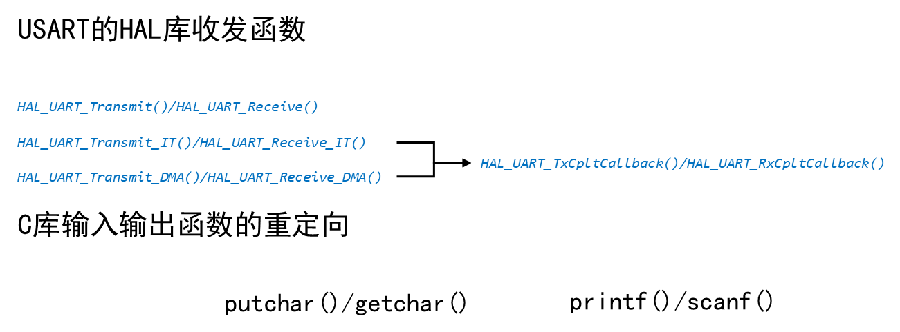

# 串口驱动开发
## 一、串口基础知识
### 1.1 通信速率


### 1.2 STM32F103的USART资源概览


### 1.3 STM32F103的USART控制框图


### 1.4 STM32F103的USART收发控制


### 1.5 STM32F103的USART的发送流程


### 1.6 STM32F103的USART的接收流程


### 1.7 STM32F103的USART字符描述


### 1.8 USART的HAL库函数(仅以异步通信UART为例)


### 1.9 使用HAL库对USART的初始化流程




## 二、 调试串口代码
### driver_usart.c

```c
#include "driver_usart.h"
#include "usart.h"
#include <string.h>
#include <stdio.h>

/*
 *  函数名：DebugPrint
 *  功能描述：输出一串字符
 *  输入参数：str --> 指向要输出数据的首地址
 *  输出参数：无
 *  返回值：无
*/
void DebugPrint(const char *str)
{
    uint16_t len = strlen(str);
    
    HAL_UART_Transmit(&huart1, (uint8_t*)str, len, 3000);
}

/*
 *  函数名：DebugGet
 *  功能描述：接收指定长度的数据
 *  输入参数：str --> 指向将接收到的数据保存到内存中的首地址
 *            len --> 要接收数据的个数
 *  输出参数：无
 *  返回值：无
*/
void DebugGet(char *str, uint16_t len)
{
    while(HAL_UART_Receive(&huart1, (uint8_t*)str, len, 3000) != HAL_OK );
}

/*
 *  函数名：fputc
 *  功能描述：printf/putchar 标准输出函数的底层输出函数
 *  输入参数：ch --> 要输出的数据
 *  输出参数：无
 *  返回值：无
*/
int fputc(int ch, FILE *f)
{
    while(HAL_UART_Transmit(&huart1, (uint8_t*)&ch, 1, 3000) != HAL_OK);
}

/*
 *  函数名：fgetc
 *  功能描述：scanf/getchar 标准输出函数的底层输出函数
 *  输入参数：
 *  输出参数：无
 *  返回值：接收到的数据
*/
int fgetc(FILE *f)
{
    volatile char c = 0;
    while(HAL_UART_Receive(&huart1, (uint8_t*)&c, 1, 3000) != HAL_OK );
    
    return c;
}

```
### driver_usart.h

```c
#ifndef __DRIVER_USART_H
#define __DRIVER_USART_H

#include "stm32f1xx_hal.h"


/*
 *  函数名：DebugPrint
 *  功能描述：输出一串字符
 *  输入参数：str --> 指向要输出数据的首地址
 *  输出参数：无
 *  返回值：无
*/
extern void DebugPrint(const char *str);

/*
 *  函数名：DebugGet
 *  功能描述：接收指定长度的数据
 *  输入参数：str --> 指向将接收到的数据保存到内存中的首地址
 *            len --> 要接收数据的个数
 *  输出参数：无
 *  返回值：无
*/
extern void DebugGet(char *str, uint16_t len);
#endif /* __DRIVER_USART_H */

```
### 调试
```c
uint8_t buf[128] = {0};

DebugGet((char* )buf,1);
DebugPrint((char* )buf);
```


## 三、 中断收发

### 3.1 中断系统概览


### 3.2 中断优先级


### 3.3 HAL库下的USART中断使用


### 3.4 中断串口收发代码

#### driver_usart.c

```c
#include "driver_usart.h"
#include "usart.h"

#include <stdio.h>

static volatile uint8_t txcplt_flag = 0;    // 发送完成标志，1完成0未完成
static volatile uint8_t rxcplt_flag = 0;    // 接收完成标志，1完成0未完成

static volatile uint8_t rx_data = 0;

/*
 *  函数名：EnableDebugIRQ
 *  功能描述：使能USART1的中断
 *  输入参数：无
 *  输出参数：无
 *  返回值：无
*/
void EnableDebugIRQ(void)
{
    HAL_NVIC_SetPriority(USART1_IRQn, 0, 1);    // 设置USART1中断的优先级
    HAL_NVIC_EnableIRQ(USART1_IRQn);            // 使能USART1的中断
    
    __HAL_UART_ENABLE_IT(&huart1, UART_IT_TC | UART_IT_RXNE);   // 使能USRAT1的发送和接收中断
}

/*
 *  函数名：DisableDebugIRQ
 *  功能描述：失能USART1的中断
 *  输入参数：无
 *  输出参数：无
 *  返回值：无
*/
void DisableDebugIRQ(void)
{
    __HAL_UART_DISABLE_IT(&huart1, UART_IT_TC | UART_IT_RXNE);  // 失能USRAT1的发送和接收中断
    
    HAL_NVIC_DisableIRQ(USART1_IRQn);   // 失能USART1的中断
}

/*
 *  函数名：fputc
 *  功能描述：printf/putchar 标准输出函数的底层输出函数
 *  输入参数：ch --> 要输出的数据
 *  输出参数：无
 *  返回值：无
*/
int fputc(int ch, FILE *f)
{
    txcplt_flag = 0;
    HAL_UART_Transmit_IT(&huart1, (uint8_t*)&ch, 1);
    while(txcplt_flag==0);
}

/*
 *  函数名：fgetc
 *  功能描述：scanf/getchar 标准输出函数的底层输出函数
 *  输入参数：
 *  输出参数：无
 *  返回值：接收到的数据
*/
int fgetc(FILE *f)
{
    char c = 0;
    rxcplt_flag = 0;
    HAL_UART_Receive_IT(&huart1, (uint8_t*)&c, 1);
    while(rxcplt_flag==0);
    return c;
}

/*
 *  函数名：USART1_IRQHandler
 *  功能描述：USART1的中断服务函数
 *  输入参数：无
 *  输出参数：无
 *  返回值：无
*/
void USART1_IRQHandler(void)
{
    HAL_UART_IRQHandler(&huart1);   // HAL库中的UART统一中断服务函数，通过形参判断是要处理谁的中断
}

/*
 *  函数名：HAL_UART_RxCpltCallback
 *  功能描述：HAL库中的UART接收完成回调函数
 *  输入参数：huart --> UART的设备句柄，用以指明UART设备是哪一个UART
 *  输出参数：无
 *  返回值：无
*/
void HAL_UART_RxCpltCallback(UART_HandleTypeDef *huart)
{
    if(huart->Instance == USART1)   // 判断进来的是否是USART1这个UART设备
    {
        rxcplt_flag = 1;        // 进入此回调函数表明接收指定长度的数据已经完成，将标志置一
    }
}

/*
 *  函数名：HAL_UART_TxCpltCallback
*  功能描述：HAL库中的UART发送完成回调函数
 *  输入参数：huart --> UART的设备句柄，用以指明UART设备是哪一个UART
 *  输出参数：无
 *  返回值：无
*/
void HAL_UART_TxCpltCallback(UART_HandleTypeDef *huart)
{
    if(huart->Instance == USART1)
    {
        txcplt_flag = 1;    // 进入此回调函数表明发送指定长度的数据已经完成，将标志置一
    }
}
```
#### driver_usart.h

```c
#ifndef __DRIVER_USART_H
#define __DRIVER_USART_H

#include "stm32f1xx_hal.h"

/*
 *  函数名：EnableDebugIRQ
 *  功能描述：使能USART1的中断
 *  输入参数：无
 *  输出参数：无
 *  返回值：无
*/
extern void EnableDebugIRQ(void);

/*
 *  函数名：DisableDebugIRQ
 *  功能描述：失能USART1的中断
 *  输入参数：无
 *  输出参数：无
 *  返回值：无
*/
extern void DisableDebugIRQ(void);

#endif /* __DRIVER_USART_H */

```


## 四、 环形缓冲区

### 4.1 环形缓冲区基本概念


### 4.2 环形缓冲区：基本操作


#### 4.2.1 申请内存空间


#### 4.2.2 写数据


#### 4.2.3 读数据


#### 4.2.4 小结


### 4.3 判断缓冲区没有数据


### 4.4 判断缓冲区写满数据


#### ring_buffer.c

```c
#include "ring_buffer.h"

/*
 *  函数名：ring_buffer_init
 *  功能描述：初始化缓冲区
 *  输入参数：dst_buf --> 指向目标缓冲区
 *  输出参数：无
 *  返回值：无
*/
void ring_buffer_init(ring_buffer *dst_buf)
{
    dst_buf->pW = 0;
    dst_buf->pR = 0;
}

/*
 *  函数名：ring_buffer_write
 *  功能描述：向目标缓冲区写入一个字节的数据，如果缓冲区满了就丢掉此数据
 *  输入参数：c --> 要写入的数据
 *            dst_buf --> 指向目标缓冲区
 *  输出参数：无
 *  返回值：无
*/
void ring_buffer_write(unsigned char c, ring_buffer *dst_buf)
{
    int i = (dst_buf->pW + 1) % BUFFER_SIZE;
    if(i != dst_buf->pR)    // 环形缓冲区没有写满
    {
        dst_buf->buffer[dst_buf->pW] = c;
        dst_buf->pW = i;
    }
}

/*
 *  函数名：ring_buffer_read
 *  功能描述：从目标缓冲区读取一个字节的数据，如果缓冲区空了返回-1表明读取失败
 *  输入参数：c --> 指向将读到的数据保存到内存中的地址
 *            dst_buf --> 指向目标缓冲区
 *  输出参数：无
 *  返回值：读到数据返回0，否则返回-1
*/
int ring_buffer_read(unsigned char *c, ring_buffer *dst_buf)
{
    if(dst_buf->pR == dst_buf->pW)
    {
        return -1;
    }
    else
    {
        *c = dst_buf->buffer[dst_buf->pR];
        dst_buf->pR = (dst_buf->pR + 1) % BUFFER_SIZE;
        return 0;
    }
}

```
#### ring_buffer.h

```c

#ifndef __RING_BUFFER_H
#define __RING_BUFFER_H

#include "stm32f1xx_hal.h"

#define BUFFER_SIZE 1024        /* 环形缓冲区的大小 */
typedef struct
{
    unsigned char buffer[BUFFER_SIZE];  /* 缓冲区空间 */
    volatile unsigned int pW;           /* 写地址 */
    volatile unsigned int pR;           /* 读地址 */
} ring_buffer;

/*
 *  函数名：ring_buffer_init
 *  功能描述：初始化缓冲区
 *  输入参数：dst_buf --> 指向目标缓冲区
 *  输出参数：无
 *  返回值：无
*/
extern void ring_buffer_init(ring_buffer *dst_buf);

/*
 *  函数名：ring_buffer_write
 *  功能描述：向目标缓冲区写入一个字节的数据，如果缓冲区满了就丢掉此数据
 *  输入参数：c --> 要写入的数据
 *            dst_buf --> 指向目标缓冲区
 *  输出参数：无
 *  返回值：无
*/
extern void ring_buffer_write(unsigned char c, ring_buffer *dst_buf);

/*
 *  函数名：ring_buffer_read
 *  功能描述：从目标缓冲区读取一个字节的数据，如果缓冲区空了返回-1表明读取失败
 *  输入参数：c --> 指向将读到的数据保存到内存中的地址
 *            dst_buf --> 指向目标缓冲区
 *  输出参数：无
 *  返回值：读到数据返回0，否则返回-1
*/
extern int ring_buffer_read(unsigned char *c, ring_buffer *dst_buf);

#endif /* __RING_BUFFER_H */

```
#### 调试

```c


```