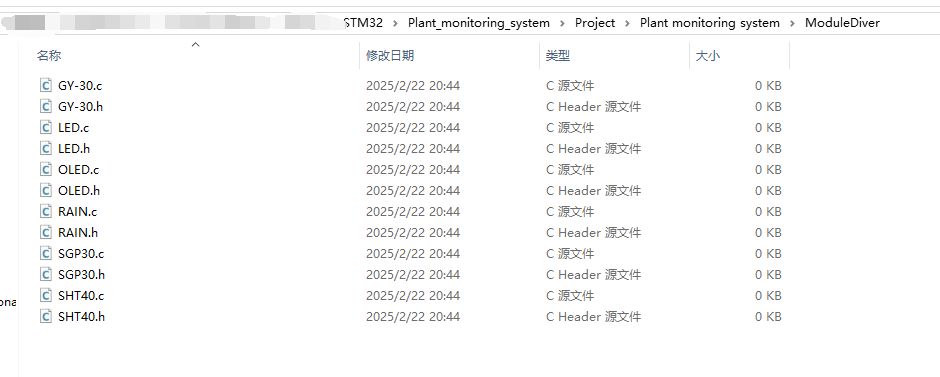

# 植物监测系统模块驱动开发
## 一、新建驱动文件
### 1.1 创建文件夹”ModuleDiver“


### 1.2 新建驱动文件


### 1.3 在Keil中添加路径


## 二、模块功能性能及替代品分析
### 2.1 GY - 30光照强度检测模块
- **功能性能**：GY - 30是基于BH1750FVI芯片设计的数字光照度传感器 ，通过I2C接口与单片机通信，能直接输出以勒克斯(lux)为单位的光照强度数值，测量范围为1 - 65535 lux，工作电压3 - 5V，测量精度可达1 lux，响应时间120ms ，功耗低至0.01mW。在植物监测系统里，能实时监测植物生长环境的光照强度，为光照调节提供数据支撑。
- **替代品分析**：BH1750和GY - 30基于同一款芯片，性能相近。TSL2561也是不错的选择，其对不同波长的光有不同的响应特性，可用于一些对光照光谱分析有要求的场景。不过，GY - 30在价格亲民，通用性好，在本系统中能很好地满足需求。

### 2.2 LED状态指示模块
- **功能性能**：通过GPIO口控制LED的亮灭，以此指示系统的工作状态，像电源指示、数据传输指示等。LED响应速度快，能在瞬间完成亮灭切换；功耗低，不会过多消耗系统电能；寿命长，可长时间稳定工作。
- **替代品分析**：从简单状态指示角度，用LCD段码屏代替LED是可行的，LCD段码屏能显示数字、简单字符等更多信息。但它驱动复杂，需要专门的驱动芯片和程序，功耗也较大。在仅需简单状态指示的情况下，LED成本低、易驱动，是更好的选择。

### 2.3 OLED显示模块
- **功能性能**：OLED显示屏用于呈现系统的各类信息，如温湿度数据、光照强度、空气质量等。它自发光的特性使其无需背光模组，能节省空间和功耗；对比度高，显示的内容清晰锐利；视角广，在不同角度都能清晰观看；响应速度快，画面切换流畅。通过I2C接口与STM32通信，本系统采用软件I2C驱动。
- **替代品分析**：TFT液晶显示屏色彩丰富、可显示复杂图形界面，但成本高，需要专门的控制器和驱动芯片，驱动难度大，还需背光模组，功耗较高。对于本植物监测系统，OLED显示屏在满足基本显示需求的同时，成本和功耗优势明显。

### 2.4 RAIN雨水检测模块
- **功能性能**：通过检测电极之间的电阻变化判断是否降雨。当有雨水时，雨水会使电极之间形成导电通路，电阻发生明显变化，模块输出相应信号给STM32微控制器。在植物监测系统中，为灌溉系统的启停控制提供依据。
- **替代品分析**：电容式雨水传感器通过检测电容变化判断降雨，响应速度更快，精度更高。但它的成本相对较高，需要更复杂的电路设计来检测电容变化。对于一般的植物监测应用，现有的RAIN模块能满足基本检测需求，性价比更高。

### 2.5 SGP30空气质量检测模块
- **功能性能**：借助SPI接口与STM32通信，能实时监测空气中的TVOC（总挥发性有机化合物）和eCO₂（等效二氧化碳）浓度。具有高精度，能准确检测空气中的污染物含量；低功耗，适合长期运行的监测系统；响应速度快，能及时反馈空气质量变化。
- **替代品分析**：MICS - 6814能检测多种气体，但在检测精度和稳定性上不如SGP30。SGP30在本系统中更能满足对空气质量精确监测的要求。

### 2.6 SHT40温湿度检测模块
- **功能性能**：通过I2C接口与STM32通信，快速准确地测量环境温度和湿度。温度测量范围一般为-40℃ - 125℃，湿度测量范围为0 - 100%RH，测量精度高，稳定性好，为植物生长环境的温湿度监测提供可靠数据。
- **替代品分析**：DHT11价格较低，但测量精度和稳定性不如SHT40。SHT40在精度和稳定性上的优势，更适合对温湿度测量精度要求高的植物监测系统。

## 三、各模块驱动编写
### 3.1 GY - 30驱动编写
- **I2C通信配置**：因使用软件I2C，在代码中定义软件I2C的引脚（比如SCL和SDA对应的GPIO口），编写初始化函数。初始化函数里，设置引脚为推挽输出模式，配置好GPIO口的速度和上下拉电阻等参数，再初始化引脚电平。
- **数据读取函数**：编写读取GY - 30数据的函数。依据GY - 30的通信协议，先用软件I2C发送读取命令，命令的格式和内容要符合协议规定。发送成功后，接收返回的数据，按照协议解析数据，将原始数据换算成实际的光照强度值。
```c
// 软件I2C初始化函数
void GY30_SoftI2C_Init(void)
{
    // 配置SCL和SDA引脚为推挽输出
    GPIO_InitTypeDef GPIO_InitStruct = {0};
    __HAL_RCC_GPIOx_CLK_ENABLE(); // 使能对应的GPIO时钟
    GPIO_InitStruct.Pin = GPIO_PIN_SCL | GPIO_PIN_SDA;
    GPIO_InitStruct.Mode = GPIO_MODE_OUTPUT_PP;
    GPIO_InitStruct.Speed = GPIO_SPEED_FREQ_HIGH;
    HAL_GPIO_Init(GPIOx, &GPIO_InitStruct);
    // 初始化引脚电平
    HAL_GPIO_WritePin(GPIOx, GPIO_PIN_SCL, GPIO_PIN_SET);
    HAL_GPIO_WritePin(GPIOx, GPIO_PIN_SDA, GPIO_PIN_SET);
}

// 软件I2C发送一个字节
void GY30_SoftI2C_SendByte(uint8_t byte)
{
    // 实现发送字节的逻辑，包括位操作和SCL、SDA引脚电平控制
    for(int i = 0; i < 8; i++){
        if(byte & 0x80)
            HAL_GPIO_WritePin(GPIOx, GPIO_PIN_SDA, GPIO_PIN_SET);
        else
            HAL_GPIO_WritePin(GPIOx, GPIO_PIN_SDA, GPIO_PIN_RESET);
        byte <<= 1;
        HAL_GPIO_WritePin(GPIOx, GPIO_PIN_SCL, GPIO_PIN_SET);
        HAL_GPIO_WritePin(GPIOx, GPIO_PIN_SCL, GPIO_PIN_RESET);
    }
}

// 软件I2C接收一个字节
uint8_t GY30_SoftI2C_ReceiveByte(void)
{
    // 实现接收字节的逻辑，包括位操作和SCL、SDA引脚电平控制
    uint8_t received_byte = 0;
    for(int i = 0; i < 8; i++){
        received_byte <<= 1;
        HAL_GPIO_WritePin(GPIOx, GPIO_PIN_SCL, GPIO_PIN_SET);
        if(HAL_GPIO_ReadPin(GPIOx, GPIO_PIN_SDA))
            received_byte |= 0x01;
        HAL_GPIO_WritePin(GPIOx, GPIO_PIN_SCL, GPIO_PIN_RESET);
    }
    return received_byte;
}

// 读取GY - 30光照强度数据
float GY30_ReadLightIntensity(void)
{
    // 发送读取命令
    GY30_SoftI2C_SendByte(0x23);
    // 接收数据
    uint8_t data[2];
    data[0] = GY30_SoftI2C_ReceiveByte();
    data[1] = GY30_SoftI2C_ReceiveByte();
    // 数据处理，转换为实际光照强度值
    uint16_t raw_data = (data[0] << 8) | data[1];
    float light_intensity = (float)raw_data / 1.2;
    return light_intensity;
}
```

### 3.1 KEY驱动编写
- **I2C通信配置**：因使用软件I2C，在代码中定义软件I2C的引脚（比如SCL和SDA对应的GPIO口），编写初始化函数。初始化函数里，设置引脚为推挽输出模式，配置好GPIO口的速度和上下拉电阻等参数，再初始化引脚电平。
- **数据读取函数**：编写读取GY - 30数据的函数。依据GY - 30的通信协议，先用软件I2C发送读取命令，命令的格式和内容要符合协议规定。发送成功后，接收返回的数据，按照协议解析数据，将原始数据换算成实际的光照强度值。
- **KEY.c**
```c
#include "KEY.h"
#include "main.h"

/*
 *  函数名：KEY1_Value
 *  功能描述：获取按键KEY1的状态，按下返回0，否则返回1
 *  输入参数：无
 *  输出参数：无
 *  返回值：按键KEY1的状态
*/
uint8_t K1_Value(void)
{
    if(K1 == 0)
    {
        HAL_Delay(20);
        if(K1 == 0)
        {
            return 0;
        }
        else
        {
            return 1;
        }
    }
    return 1;
}

/*
 *  函数名：KEY1_Value
 *  功能描述：获取按键KEY1的状态，按下返回0，否则返回1
 *  输入参数：无
 *  输出参数：无
 *  返回值：按键KEY1的状态
*/
uint8_t K2_Value(void)
{
    if(K2 == 0)
    {
        HAL_Delay(20);
        if(K2 == 0)
        {
            return 0;
        }
        else
        {
            return 1;
        }
    }
    return 1;
}

```
- **KEY.h**
```c
#ifndef __KEY_H
#define __KEY_H

#include "stm32f1xx_hal.h"

/*********************
 * 函数宏定义
**********************/
#define K1      HAL_GPIO_ReadPin(K1_GPIO_Port, K1_Pin)
#define K2      HAL_GPIO_ReadPin(K2_GPIO_Port, K2_Pin)

extern uint8_t K1_Value(void);
extern uint8_t K2_Value(void);

#endif /* __DRIVER_KEY_H */

```

### 3.2 LED驱动编写
- **GPIO配置**：在STM32CubeMX生成的GPIO初始化代码基础上，找到LED对应的GPIO口，确认其配置为输出模式，设置好输出速度等参数。
- **控制函数**：编写控制LED亮灭的函数，利用HAL库函数HAL_GPIO_WritePin实现对LED的控制。输入不同的引脚电平值，即可控制LED的亮灭状态。
- **LED.c**
```c 
#include "led.h"
#include "main.h"

/*
 *  函数名：LedOn
 *  功能描述：PC13输出高电平，点亮蓝色LED
 *  输入参数：无
 *  输出参数：无
 *  返回值：无
*/
void LedOn(void)
{
    HAL_GPIO_WritePin(LED_GPIO_Port, LED_Pin, (GPIO_PinState)1);
}

/*
 *  函数名：LedOff
 *  功能描述：PC13输出低电平，熄灭蓝色LED
 *  输入参数：无
 *  输出参数：无
 *  返回值：无
*/
void LedOff(void)
{
    HAL_GPIO_WritePin(LED_GPIO_Port, LED_Pin, (GPIO_PinState)0);
}

/*
 *  函数名：BlueShine
 *  功能描述：使用HAL_GPIO_TogglePin函数改变PC13的电平，闪烁蓝色LED
 *  输入参数：无
 *  输出参数：无
 *  返回值：无
*/
void BlueShine(void)
{
    HAL_GPIO_TogglePin(LED_GPIO_Port, LED_Pin);
    HAL_Delay(500);
}

```
- **LED.h**
```c 
#ifndef __LED_H
#define __LED_H

#define LED_Pin GPIO_PIN_13
#define LED_GPIO_Port GPIOC

// 函数声明
extern void LedOn(void);
extern void LedOff(void);
extern void BlueShine(void);

#endif /* __LED_H */

```
### 3.3 OLED驱动编写
- **软件I2C通信**：和GY - 30的软件I2C通信配置类似，定义OLED的软件I2C引脚并初始化，确保引脚配置正确，能正常进行I2C通信。
- **OLED命令和数据发送函数**：按照OLED的通信协议，编写发送命令和数据的函数。发送命令时，先发送控制字节，表明是命令，再发送具体的命令内容；发送数据时同理，先发送控制字节，再发送数据。
- **显示函数**：编写各类显示函数，如显示字符、数字、图形等。以显示字符为例，先计算显示位置和对应的地址，发送地址命令，再发送字符对应的点阵数据，逐行逐列地在OLED上显示出字符。
```c
// 发送OLED命令
void OLED_SendCommand(uint8_t command)
{
    // 发送命令前先发送控制字节，指示为命令
    GY30_SoftI2C_SendByte(0x00);
    GY30_SoftI2C_SendByte(command);
}

// 发送OLED数据
void OLED_SendData(uint8_t data)
{
    // 发送数据前先发送控制字节，指示为数据
    GY30_SoftI2C_SendByte(0x40);
    GY30_SoftI2C_SendByte(data);
}

// 初始化OLED
void OLED_Init(void)
{
    // 发送一系列初始化命令
    OLED_SendCommand(0xAE); // 关闭显示
    OLED_SendCommand(0xD5); // 设置显示时钟分频比/振荡器频率
    OLED_SendCommand(0x80); 
    OLED_SendCommand(0xA8); // 设置多路复用率
    OLED_SendCommand(0x3F); 
    OLED_SendCommand(0xD3); // 设置显示偏移
    OLED_SendCommand(0x00); 
    OLED_SendCommand(0x40); // 设置显示起始行
    OLED_SendCommand(0xA1); // 设置段重映射
    OLED_SendCommand(0xC8); // 设置COM输出扫描方向
    OLED_SendCommand(0xDA); // 设置COM引脚硬件配置
    OLED_SendCommand(0x12); 
    OLED_SendCommand(0x81); // 设置对比度控制
    OLED_SendCommand(0xCF); 
    OLED_SendCommand(0xD9); // 设置预充电周期
    OLED_SendCommand(0xF1); 
    OLED_SendCommand(0xDB); // 设置VCOMH取消选择级别
    OLED_SendCommand(0x30); 
    OLED_SendCommand(0xA4); // 设置整个显示打开/关闭
    OLED_SendCommand(0xA6); // 设置正常/反向显示
    OLED_SendCommand(0x8D); // 设置电荷泵使能
    OLED_SendCommand(0x14); 
    OLED_SendCommand(0xAF); // 打开显示
}

// 在OLED上显示字符
void OLED_DisplayChar(uint8_t x, uint8_t y, char ch)
{
    // 计算显示位置和对应的地址
    uint8_t address = 0x80 + y * 16 + x;
    OLED_SendCommand(address);
    // 发送字符对应的点阵数据
    for (uint8_t i = 0; i < 8; i++)
    {
        OLED_SendData(font[ch - ' '][i]);
    }
}
// 假设已经定义好了font数组，存放字符的点阵数据
const uint8_t font[95][8] = {
// 字符点阵数据
};
```

### 3.4 RAIN驱动编写
- **GPIO配置**：把RAIN模块的输出引脚配置为输入模式，在STM32CubeMX生成的GPIO初始化代码里完成相应设置，设置好输入模式和上下拉电阻等参数。
- **检测函数**：编写检测是否有雨水的函数，利用HAL库函数HAL_GPIO_ReadPin读取RAIN模块输出引脚的电平状态。若电平状态符合有雨水的条件，返回相应标志；否则，返回无雨水标志。
```c
// 检测是否有雨水
uint8_t RAIN_DetectRain(void)
{
    return HAL_GPIO_ReadPin(RAIN_GPIO_Port, RAIN_Pin);
}
```

### 3.5 SGP30驱动编写
- **SPI通信配置**：基于STM32CubeMX生成的SPI初始化代码，检查SPI配置是否正确。包括时钟极性（CPOL）设置为高或低，决定空闲时时钟线的电平；时钟相位（CPHA）设置为0或1，决定数据采样的时刻；数据位长度设置为8位或其他合适的值，确保与SGP30的通信要求匹配。
- **初始化和数据读取函数**：依照SGP30的通信协议，编写初始化函数。初始化函数里，向SGP30发送初始化命令序列，每个命令的格式和顺序要符合协议规定。编写读取TVOC和eCO₂数据的函数，先发送读取数据命令，等待SGP30响应，再通过SPI通信接收数据，按照协议解析数据，得到实际的TVOC和eCO₂浓度值。
```c
// SGP30初始化
void SGP30_Init(void)
{
    // 发送初始化命令序列
    uint8_t init_command[2] = {0x20, 0x03};
    HAL_SPI_Transmit(&hspi1, init_command, 2, 1000);
}

// 读取SGP30数据
void SGP30_ReadData(uint16_t *tvoc, uint16_t *eco2)
{
    // 发送读取数据命令
    uint8_t read_command[2] = {0x20, 0x08};
    HAL_SPI_Transmit(&hspi1, read_command, 2, 1000);
    // 接收数据
    uint8_t data[4];
    HAL_SPI_Receive(&hspi1, data, 4, 1000);
    // 数据处理
    *tvoc = (data[0] << 8) | data[1];
    *eco2 = (data[2] << 8) | data[3];
}
```

### 3.6 SHT40驱动编写
- **软件I2C通信**：和GY - 30、OLED的软件I2C通信配置一致，确保SHT40的软件I2C引脚正确配置和初始化，保证I2C通信的稳定性。
- **初始化和数据读取函数**：根据SHT40的通信协议，编写初始化函数，向SHT40发送初始化命令。编写读取温度和湿度数据的函数，先发送读取命令，接收数据时，按照协议规定的格式和校验方式，对接收到的数据进行校验，确保数据的准确性，再将校验通过的数据转换为实际的温度和湿度值。
```c
// SHT40初始化
void SHT40_Init(void)
{
    // 发送初始化命令
    GY30_SoftI2C_SendByte(0x24);
    GY30_SoftI2C_SendByte(0x00);
}

// 读取SHT40温湿度数据
void SHT40_ReadData(float *temperature, float *humidity)
{
    // 发送读取命令
    GY30_SoftI2C_SendByte(0xE0);
    GY30_SoftI2C_SendByte(0x00);
    // 接收数据
    uint8_t data[6];
    for (uint8_t i = 0; i < 6; i++)
    {
        data[i] = GY30_SoftI2C_ReceiveByte();
    }

    // 数据校验和转换
    uint16_t raw_temperature = (data[0] << 8) | data[1];
    uint16_t raw_humidity = (data[3] << 8) | data[4];

    // 计算温度值，公式根据SHT40数据手册
    *temperature = -45 + (175 * (float)raw_temperature / 65535); 

    // 计算湿度值，公式根据SHT40数据手册
    *humidity = 100 * (float)raw_humidity / 65535; 
}
```

## 五、驱动测试与调试
### 5.1 测试环境搭建
- **硬件连接**：将各模块正确连接到STM32F103C8T6开发板上，确保GY - 30、OLED、SHT40通过I2C接口连接（使用软件I2C对应的引脚），SGP30通过SPI接口连接，RAIN模块和LED连接到相应的GPIO口。
- **软件配置**：在Keil MDK - ARM中打开项目工程，确保已将编写好的各模块驱动代码添加到工程中，并正确配置编译和调试选项，如选择合适的芯片型号、下载算法等。

### 5.2 测试方法
- **GY - 30模块测试**：在主程序中调用`GY30_ReadLightIntensity`函数，读取光照强度数据，并通过串口或OLED显示屏输出数据。在不同光照条件下（如室内、室外、遮挡光线等）观察数据变化，判断数据是否合理，与实际光照情况是否相符。
- **LED模块测试**：分别调用`LED_On`和`LED_Off`函数，观察LED是否能正常点亮和熄灭。可以通过编写循环代码，让LED闪烁，进一步验证其功能的稳定性。
- **OLED模块测试**：调用`OLED_Init`函数初始化OLED，然后依次调用显示字符、数字、图形等函数，在OLED显示屏上显示不同内容。检查显示内容是否清晰、准确，位置是否正确。
- **RAIN模块测试**：模拟降雨场景，如用湿布擦拭RAIN模块的检测电极，调用`RAIN_DetectRain`函数，检查函数返回值是否与实际情况相符，判断模块是否能正确检测到雨水。
- **SGP30模块测试**：调用`SGP30_Init`函数初始化SGP30，然后调用`SGP30_ReadData`函数，读取TVOC和eCO₂数据，并输出显示。在不同空气质量环境下（如室内通风良好、室内密闭、靠近污染源等）观察数据变化，判断数据的准确性。
- **SHT40模块测试**：调用`SHT40_Init`函数初始化SHT40，接着调用`SHT40_ReadData`函数，读取温度和湿度数据并显示。在不同温湿度环境下（如空调房、室外高温潮湿、干燥环境等）观察数据变化，与实际温湿度情况对比，验证数据的准确性。

### 5.3 常见问题及解决方法
- **通信错误**：若出现模块无法通信的情况，首先检查硬件连接是否正确，包括引脚是否接错、是否有虚焊等问题。对于I2C和SPI通信，检查时钟线和数据线的电平是否正常，可以使用逻辑分析仪进行测量。软件方面，确认通信协议的实现是否正确，如数据传输的顺序、格式、校验等。
- **数据异常**：当读取到的数据不合理或不准确时，先检查模块的初始化是否正确，是否按照模块的数据手册进行配置。对于传感器模块，要考虑环境因素对数据的影响，如温度、湿度对某些传感器精度的影响。同时，检查数据处理和转换的代码是否正确，是否符合模块的数据手册要求。
- **模块不工作**：若模块没有任何反应，检查模块的供电是否正常，工作电压是否在模块的额定范围内。对于一些需要特定初始化序列的模块，确认初始化过程是否完整、正确。

## 六、总结
### 6.1 驱动功能总结
本文档中完成的各模块驱动实现了植物监测系统中关键硬件的功能控制与数据采集。GY - 30驱动能够实时获取光照强度数据，LED驱动可用于系统状态指示，OLED驱动实现了信息的可视化显示，RAIN驱动能准确检测是否降雨，SGP30驱动可监测空气质量，SHT40驱动则完成了温湿度数据的采集。这些驱动相互配合，为植物监测系统的正常运行提供了有力支持。

### 6.2 未来改进方向
- **驱动优化**：进一步优化各模块驱动的代码，提高代码的执行效率和稳定性。例如，在软件I2C通信中，优化时序控制，减少通信错误的发生；对于SPI通信，可以考虑增加数据缓存机制，提高数据传输的效率。
 - **功能扩展**：根据实际需求，扩展驱动的功能。如在OLED显示驱动中，增加更多的图形绘制函数，支持更复杂的界面设计；对于传感器驱动，可以增加数据滤波和补偿算法，提高数据的准确性。
 - **兼容性提升**：考虑不同型号硬件模块的兼容性，使驱动能够适应更多种类的传感器和显示模块，提高系统的通用性和可扩展性。 

